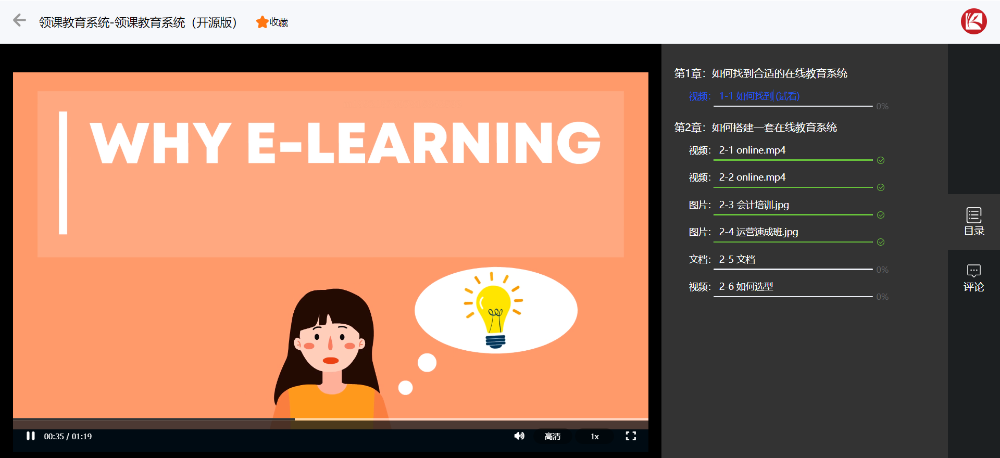
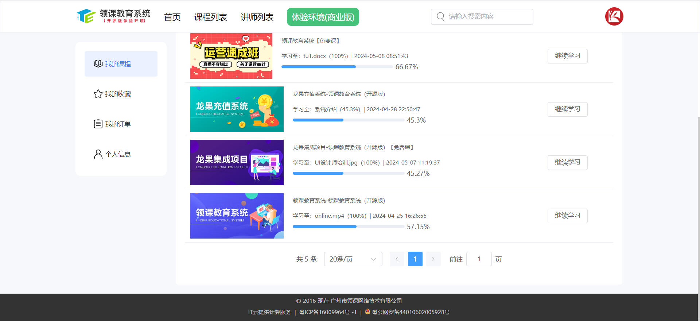
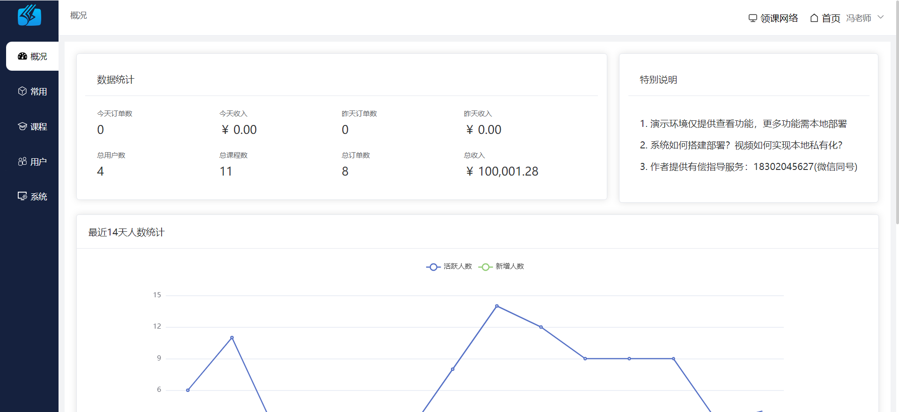
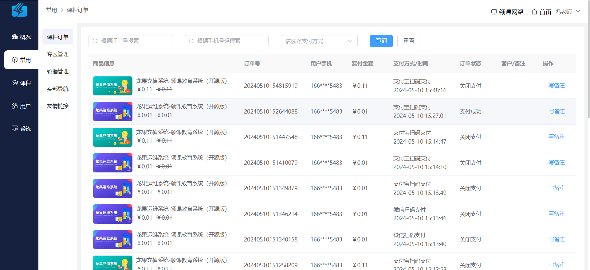
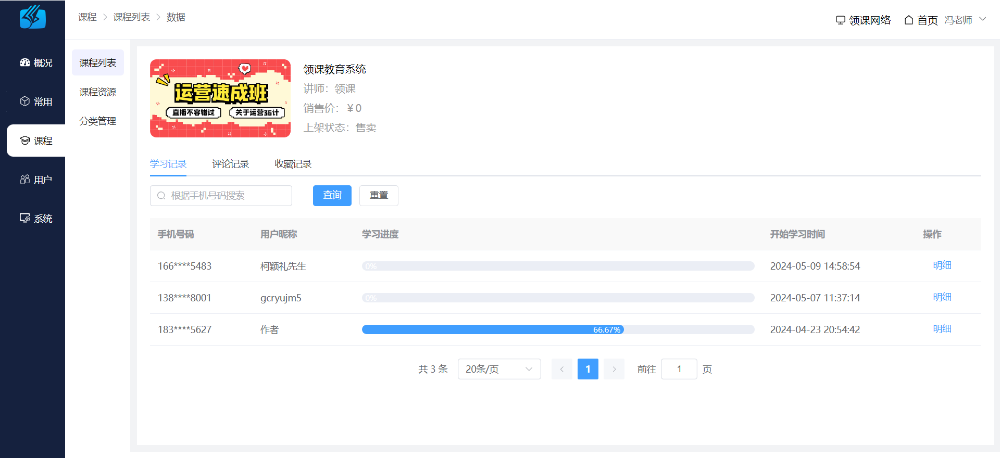
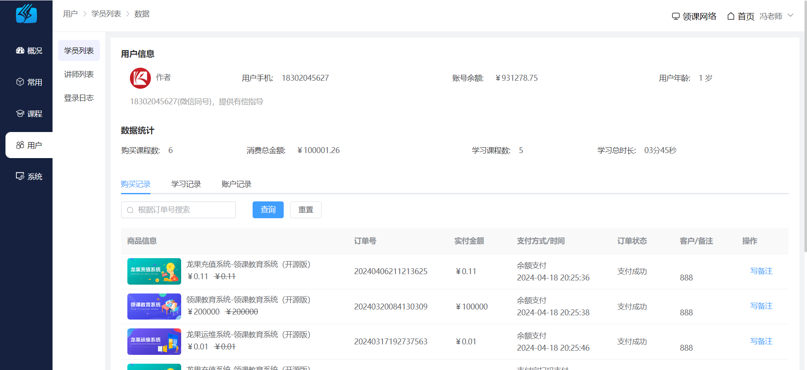

    
    

        
         
         
         
    

### 使用须知

1. 允许用于个人学习、毕业设计、教学案例、公益事业等。
2. 限制商用，若需要商业使用请咨询作者：18302045627（微信可加）。
3. 禁止将本项目的相关代码和相关资料进行任何形式任何名义的出售。

### 项目介绍

领课教育系统（roncoo-education）是基于领课网络多年的在线教育平台开发和运营经验打造出来的产品，致力于打造一个各行业都适用的分布式在线教育系统。系统采用前后端分离模式，前台采用vue.js为核心框架，后台采用Spring
Cloud为核心框架。系统目前主要功能有课程点播功能，支持多家视频云的接入，课程附件管理功能，支持多家存储云的接入，可以帮助个人或者企业快速搭建一个轻量级的在线教育平台。

<table>
  <tr>
    <td></td>
    <td></td>
  </tr>
  <tr>
    <td></td>
    <td></td>
  </tr>
  <tr>
    <td></td>
    <td></td>
  </tr>
  <tr>
    <td></td>
    <td></td>
  </tr>
</table>

### 演示地址

* 门户系统：[https://eduos.roncoos.com/](https://eduos.roncoos.com/)
* 管理系统：[https://eduos.roncoos.com/admin/](https://eduos.roncoos.com/admin/)
* 前端技术体系：Vue3 + Nuxt3 + Vite5 + Vue-Router + Element-Plus + Pinia + Axios
* 后端技术体系：Spring Cloud Alibaba2021 + MySQL8 + Nacos + Seata + Mybatis + Druid

### 源码地址

* 后端系统：roncoo-education（核心框架：Spring Cloud Alibaba）：[码云](https://gitee.com/roncoocom/roncoo-education) | [Github](https://github.com/roncoo/roncoo-education) | [Gitcode](https://gitcode.com/roncoocom/roncoo-education)
* 门户系统：roncoo-education-web（核心框架：Nuxt3）：[码云](https://gitee.com/roncoocom/roncoo-education-web) | [Github](https://github.com/roncoo/roncoo-education-web) | [Gitcode](https://gitcode.com/roncoocom/roncoo-education-web)
* 管理系统：roncoo-education-admin（核心框架：Vue3）：[码云](https://gitee.com/roncoocom/roncoo-education-admin) | [Github](https://github.com/roncoo/roncoo-education-admin) | [Gitcode](https://gitcode.com/roncoocom/roncoo-education-admin)

---

关注微信公众号可获取更多学习资料（SQL脚本、部署教程、常见问题等）

